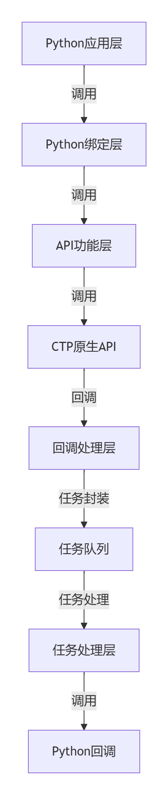

# API_For_Strategy

vnpy封装的ctp接口是用C++编写并通过pybind11提供Python接口

交易API: vnctptd  
1. 程序总体架构  
程序用TdApi类封装了期货交易API的功能，通过多线程任务队列机制处理异步事件和回调，并通过Python的gil_scoped_acquire机制确保线程安全。  
   >task_queue：任务队列，用于存储待处理的任务。  
   >task_thread：处理任务的线程。  
   >processTask()方法在独立线程中运行，不断从队列取出任务，并通过task_name区分不同事件类型分发

   
   
2. 核心模块  
   1. API接口模块（TdApi类）:  
   负责与CTP交易系统的底层交互。  
   提供交易相关的功能接口（如登录、下单、查询等）。  
   处理来自交易系统的回调事件（如订单状态更新、成交回报等）。  

   2. 任务队列模块（Task结构）:  
   封装任务信息，包括任务名称、数据和错误信息。  
   通过队列机制实现异步任务调度，避免阻塞主线程。  

   3. 回调处理模块（processTask方法）:  
   从任务队列中取出任务，根据任务类型调用相应的回调函数。

   4. 错误处理模块:  
   封装错误信息（CThostFtdcRspInfoField）。  
   通过task_error传递错误码和错误消息。


3. 模块调用阶段  
   1. 初始化阶段  
      1. 调用createFtdcTraderApi创建API实例。  
      ```C++
      //vnctptd.cpp
      void TdApi::createFtdcTraderApi(string pszFlowPath)
      //注册一个派生自CThostFtdcTraderSpi 接口类的实例，该实例将完成事件处理。
      {  
          this->api = CThostFtdcTraderApi::CreateFtdcTraderApi(pszFlowPath.c_str());
          this->api->RegisterSpi(this);
      };
      ```

      2. 调用registerFront连接交易前置机。
      ```C++
      //vnctptd.cpp
      void TdApi::registerFront(string pszFrontAddress)
      //设置交易托管系统的网络通讯地址，交易托管系统拥有多个通信地址，但用户只需要选择一个通信地址。
      {
          this->api->RegisterFront((char*)pszFrontAddress.c_str());
      };
      ```
      3. 调用init初始化API并启动任务处理线程。
      ```C++
      //vnctptd.cpp
      void TdApi::init()
      {
          this->active = true;
          this->task_thread = thread(&TdApi::processTask, this);
          this->api->Init();
          //使客户端开始与交易托管系统建立连接，连接成功后可以进行登陆。
      };
      ```

      2. 请求发送阶段  
      用户调用请求函数（如reqOrderInsert）时，程序构造CTP数据结构并发送请求。
      请求函数返回请求ID（reqid），用于匹配后续的回调。  
         >1. 用户认证类  
            reqAuthenticate: 客户端认证请求。  
            reqUserLogin: 用户登录请求。  
            reqUserLogout: 用户登出请求。  
            reqUserPasswordUpdate: 更新用户密码。  
            reqTradingAccountPasswordUpdate: 更新资金账户密码。  
         >2. 交易类（以报单录入请求为例）  
            reqOrderInsert: 报单录入请求。  
            reqParkedOrderInsert: 预埋单录入请求。  
            reqOrderAction: 报单操作请求（撤单）。  
            reqParkedOrderAction: 预埋撤单请求。  
            reqExecOrderInsert: 执行宣告录入请求。  
            reqExecOrderAction: 执行宣告操作请求。  
            reqForQuoteInsert: 询价录入请求。  
            reqQuoteInsert: 报价录入请求。  
            reqQuoteAction: 报价操作请求。  
            reqBatchOrderAction: 批量报单操作请求。  
            
            报单录入请求reqOrderInsert：
         ```C++
         //vnctptd.cpp
         int TdApi::reqOrderInsert(const dict &req, int reqid)
         {
             CThostFtdcInputOrderField myreq = CThostFtdcInputOrderField();
             memset(&myreq, 0, sizeof(myreq));
             getString(req, "BrokerID", myreq.BrokerID);
             getString(req, "InvestorID", myreq.InvestorID);
             getString(req, "reserve1", myreq.reserve1);
             getString(req, "OrderRef", myreq.OrderRef);
             getString(req, "UserID", myreq.UserID);
             getChar(req, "OrderPriceType", &myreq.OrderPriceType);
             getChar(req, "Direction", &myreq.Direction);
             getString(req, "CombOffsetFlag", myreq.CombOffsetFlag);
             getString(req, "CombHedgeFlag", myreq.CombHedgeFlag);
             getDouble(req, "LimitPrice", &myreq.LimitPrice);
             getInt(req, "VolumeTotalOriginal", &myreq.VolumeTotalOriginal);
             getChar(req, "TimeCondition", &myreq.TimeCondition);
             getString(req, "GTDDate", myreq.GTDDate);
             getChar(req, "VolumeCondition", &myreq.VolumeCondition);
             getInt(req, "MinVolume", &myreq.MinVolume);
             getChar(req, "ContingentCondition", &myreq.ContingentCondition);
             getDouble(req, "StopPrice", &myreq.StopPrice);
             getChar(req, "ForceCloseReason", &myreq.ForceCloseReason);
             getInt(req, "IsAutoSuspend", &myreq.IsAutoSuspend);
             getString(req, "BusinessUnit", myreq.BusinessUnit);
             getInt(req, "RequestID", &myreq.RequestID);
             getInt(req, "UserForceClose", &myreq.UserForceClose);
             getInt(req, "IsSwapOrder", &myreq.IsSwapOrder);
             getString(req, "ExchangeID", myreq.ExchangeID);
             getString(req, "InvestUnitID", myreq.InvestUnitID);
             getString(req, "AccountID", myreq.AccountID);
             getString(req, "CurrencyID", myreq.CurrencyID);
             getString(req, "ClientID", myreq.ClientID);
             getString(req, "reserve2", myreq.reserve2);
             getString(req, "MacAddress", myreq.MacAddress);
             getString(req, "InstrumentID", myreq.InstrumentID);
             getString(req, "IPAddress", myreq.IPAddress);
             int i = this->api->ReqOrderInsert(&myreq, reqid);
         
             //以下参数信息在ctp-API接口文档中可获取
             //TThostFtdcBrokerIDType BrokerID 经纪公司代码 必填 
             //TThostFtdcInvestorIDType InvestorID 投资者代码 必填 
             //TThostFtdcInstrumentIDType InstrumentID 合约代码 必填 
             //TThostFtdcOrderRefType OrderRef 报单引用 可自定义或不填 
             //TThostFtdcUserIDType UserID 用户代码 无 
             //TThostFtdcCombOffsetFlagType CombOffsetFlag 开平标志 必填 
             //TThostFtdcCombHedgeFlagType CombHedgeFlag 投机套保标志 必填 
             //TThostFtdcDateType GTDDate GTD日期 无 
             //TThostFtdcBusinessUnitType BusinessUnit 业务单元 无 
             //TThostFtdcExchangeIDType ExchangeID 交易所代码 必填 
             //TThostFtdcInvestUnitIDType InvestUnitID 投资单元代码 无 
             //TThostFtdcAccountIDType AccountID 投资者帐号 无 
             //TThostFtdcCurrencyIDType CurrencyID 币种代码 无 
             //TThostFtdcClientIDType ClientID 客户代码 无 
             //TThostFtdcIPAddressType IPAddress IP地址 无 
             //TThostFtdcMacAddressType MacAddress Mac地址 无 
             //TThostFtdcVolumeType VolumeTotalOriginal 数量 必填 
             //TThostFtdcVolumeType MinVolume 最小成交量 无 
             //TThostFtdcBoolType IsAutoSuspend 自动挂起标志 必填0 
             //TThostFtdcRequestIDType RequestID 请求编号 无 
             //TThostFtdcBoolType UserForceClose 用户强平标志 无 
             //TThostFtdcBoolType IsSwapOrder 互换单标志 必填 
             //TThostFtdcOrderPriceTypeType OrderPriceType 报单价格条件 必填 
             //TThostFtdcDirectionType Direction 买卖方向 必填 
             //TThostFtdcTimeConditionType TimeCondition 有效期类型 必填 
             //TThostFtdcVolumeConditionType VolumeCondition 成交量类型 必填 
             //TThostFtdcContingentConditionType ContingentCondition 触发条件 必填 
             //TThostFtdcForceCloseReasonType ForceCloseReason 强平原因 必填 
             //TThostFtdcPriceType LimitPrice 价格 必填 
             //TThostFtdcPriceType StopPrice 止损价 必填 
             //TThostFtdcOldInstrumentIDType reserve1 保留的无效字段 无 
             //TThostFtdcOldIPAddressType reserve2 保留的无效字段 无 
             //TThostFtdcOrderMemoType OrderMemo 报单回显字段 无 
             //TThostFtdcSequenceNo12Type SessionReqSeq session上请求计数 api自动维护 无 
         
             //OrderPriceType：确定输入的报单类型，比如限价单则填写THOST_FTDC_OPT_LimitPrice、市价单则填写THOST_FTDC_OPT_AnyPrice。
             //Direction：确定买卖方向
             //CombOffsetFlag：确定开平标志。上期所和能源交易所支持平昨和平今指令，分别对应昨仓和今仓；如果下平仓指令，则等同于平昨指令。大商所、广期所、郑商所、中金所按交易所规则只能报入平仓指令，如果报入平昨平今指令ctp会转成平仓指令报出。
             //CombHedgeFlag：确定投机套保标志，注：郑商所平仓只能报入“投机”属性 例:投机 THOST_FTDC_BHF_Speculation
             //TimeCondition：确定报单有效期类型，目前只支持GFD和IOC，其他都不支持 例:立即完成，否则撤销 THOST_FTDC_TC_IOC，为支持大商所GIS属性交易指令，新增THOST_FTDC_TC_GFS枚举值
             //VolumeCondition：确定成交量类型
             //ContingentCondition：确定触发条件
             //StopPrice：止损价，用于条件单的触发价格
             //ForceCloseReason：普通用户下单填写THOST_FTDC_FCC_NotForceClose 非强平
             //IsSwapOrder：互换单填1
             //CurrencyID：不填写默认为CNY
             //OrderRef：OrderRef是本地会话全局唯一编号，必须保持递增；可由用户维护，也可由系统自动填写。一定为数字。
             //IPAddress：手工填写本机IP地址，不自动获取。填写规则如下：ipv4原样填写，ipv6要转成非零压缩地址，即原始地址，同时要去掉冒号，eg：AAAABBBBCCCCDDDDEEEEFFFFGGGGHHHH
             //MacAddress：手工填写本机Mac地址，不自动获取。
             //BusinessUnit：保留字段。
             //LimitPrice：郑商所报单的价格会被交易所按照最小变动价位截取。(eg:报入1500.9，最小变动价位是1，会被交易所截取为1500。)其他交易所则直接返回错误。
             //OrderMemo:报单回显字段，OrderMemo字段可供终端厂商标记订单使用，CTP不做处理，即终端填写什么CTP就返回什么
             //nRequestID：请求ID，对应响应里的nRequestID，无递增规则，由用户自行维护。
             //SessionReqSeq：一个session中，一笔业务流程周期中唯一序号，此序号由API自动填写，客户维护无效。
             //OrderMemo：该字段CTP不做任何处理，即终端填写什么CTP就返回什么。可以用来给多账户系统做标记用。
             return i;
         };
         ```

         >3. 查询类
            reqQryOrder: 查询报单请求。  
            reqQryTrade: 查询成交请求。  
            reqQryInvestorPosition: 查询投资者持仓请求。  
            reqQryTradingAccount: 查询资金账户请求。  
            reqQryInvestor: 查询投资者请求。  
            reqQryInstrumentMarginRate: 查询合约保证金率请求。  
            reqQryInstrumentCommissionRate: 查询合约手续费率请求。  
            reqQryExchange: 查询交易所请求。  
            reqQryProduct: 查询产品请求。  
            reqQryInstrument: 查询合约请求。  
            reqQryDepthMarketData: 查询行情请求。  
            reqQrySettlementInfo: 查询投资者结算结果请求。  
            reqQryInvestorPositionDetail: 查询投资者持仓明细请求。  
            reqQryNotice: 查询客户通知请求。  
            reqQrySettlementInfoConfirm: 查询结算信息确认结果请求。  
            reqQryInvestorPositionCombineDetail: 查询投资者组合持仓明细请求。  
            reqQryCFMMCTradingAccountKey: 查询保证金监管系统资金账户密钥请求。  
            reqQryEWarrantOffset: 查询仓单折抵信息请求。  
            reqQryInvestorProductGroupMargin: 查询投资者品种/跨品种保证金请求。  
            reqQryExchangeMarginRate: 查询交易所保证金率请求。  
            reqQryExchangeMarginRateAdjust: 查询交易所调整保证金率请求。  
            reqQryExchangeRate: 查询汇率请求。  
            reqQrySecAgentACIDMap: 查询二级代理操作员银期权限请求。  
            reqQryProductExchRate: 查询产品汇率请求。  
            reqQryProductGroup: 查询产品组请求。  
            reqQryMMInstrumentCommissionRate: 查询做市商合约手续费率请求。  
            reqQryMMOptionInstrCommRate: 查询做市商期权合约手续费请求。  
            reqQryInstrumentOrderCommRate: 查询报单手续费请求。  
            reqQrySecAgentTradingAccount: 查询二级代理商资金账户请求。  
            reqQryOptionInstrTradeCost: 查询期权交易成本请求。  
            reqQryOptionInstrCommRate: 查询期权合约手续费请求。  
            reqQryExecOrder: 查询执行宣告请求。  
            reqQryForQuote: 查询询价请求。  
            reqQryQuote: 查询报价请求。  
            reqQryOptionSelfClose: 查询期权自对冲请求。  
            reqQryInvestUnit: 查询投资单元请求。  
            reqQryCombInstrumentGuard: 查询组合合约安全系数请求。  
            reqQryCombAction: 查询组合指令请求。  
            reqQryTransferSerial: 查询转账流水请求。  
            reqQryAccountregister: 查询银期签约关系请求。  
            reqQueryCFMMCTradingAccountToken: 查询保证金监管系统用户令牌请求。  
      3. 回调处理阶段  
         CTP系统通过回调函数返回数据。  
         回调函数将数据封装为Task对象并推入任务队列。  
         processTask从队列中取出任务，调用对应的Python回调（如onRtnOrder）。
         以下列举报单操作对应的回调规则：
            > OnRtnOrder 报单回报：指报单的状态回报，有未知单报单回报、未成交报单回报、部分成交报单回报、全部成交报单回报和撤单回报。以OrderStatus字段区分。  
            > 
            > OnRtnTrade 成交回报：指报单成交后推送的成交回报。  
            > 
            > OnRspOrderInsert 错单响应：指报单被CTP拒绝后返回的响应通知，其中ErrorID和ErrorMsg指明了错误原因。
            > 
            > OnErrRtnOrderInsert 错单回报：指报单被CTP或交易所拒绝后的报单的状态回报。
            
         CTP-API接口文档中的测试场景：
            > 测试场景4：报单合约ag1207，报入10手，到交易所先未成交，然后成交3手，然后剩余全部成交7手。
            > 
            > 报单
            > 
            > ReqOrderInsert
            > 
            > OnRtnOrder （未知单）
            > 
            > 此时CTP接收到交易所的未成交报单回报
            > 
            > OnRtnOrder （未成交）
            > 
            > 此时CTP接收到交易所的成交回报和部分成交报单回报
            > 
            > OnRtnOrder （未成交）
            > 
            > OnRtnOrder （部分成交）
            > 
            > OnRtnTrade
            > 
            > 此时CTP接收到交易所的成交回报和全部成交报单回报
            > 
            > OnRtnOrder （部分成交）
            > 
            > OnRtnOrder （全部成交）
            > 
            > OnRtnTrade
            
      4. 清理阶段  
         调用exit释放资源，停止任务线程。  
      ```C++
      //vnctptd.cpp
      int TdApi::exit()
      {
          this->active = false;
          this->task_queue.terminate();
          this->task_thread.join();
      
          this->api->RegisterSpi(NULL);
          this->api->Release();
          this->api = NULL;
          return 1;
      };
      ```


4. 关键数据结构
   1. Task结构  
   ```C++
   //vnctp.h
   //任务结构体
   struct Task
   {
       int task_name;		//回调函数名称对应的常量
       void *task_data;	//数据指针
       void *task_error;	//错误指针
       int task_id;		//请求id
       bool task_last;		//是否为最后返回
   };
   ```
   Task队列
   ```C++
   //vnctp.h
   class TaskQueue
   {
   private:
       queue<Task> queue_;						//标准库队列
       mutex mutex_;							//互斥锁
       condition_variable cond_;				//条件变量
   
       bool _terminate = false;
   
   public:
   
       //存入新的任务
       void push(const Task &task)
       {
           unique_lock<mutex > mlock(mutex_);
           queue_.push(task);					//向队列中存入数据
           mlock.unlock();						//释放锁
           cond_.notify_one();					//通知正在阻塞等待的线程
       }
   
       //取出老的任务
       Task pop()
       {
           unique_lock<mutex> mlock(mutex_);
           cond_.wait(mlock, [&]() {
               return !queue_.empty() || _terminate;
           });				//等待条件变量通知
           if (_terminate)
               throw TerminatedError();
           Task task = queue_.front();			//获取队列中的最后一个任务
           queue_.pop();						//删除该任务
           return task;						//返回该任务
       }
   
       void terminate()
       {
           _terminate = true;
           cond_.notify_all();					//通知正在阻塞等待的线程
       }
   };
   ```

   2. CTP数据结构  
   如CThostFtdcOrderField（订单）、CThostFtdcTradeField（成交）等，通过task_data传递。  
   以CThostFtdcTradeField为例：
   ```C++
   //ctp-API
   struct CThostFtdcTradeField
   {
       ///经纪公司代码
       TThostFtdcBrokerIDType  BrokerID;
       ///投资者代码
       TThostFtdcInvestorIDType    InvestorID;
       ///保留的无效字段
       TThostFtdcOldInstrumentIDType   reserve1;
       ///报单引用
       TThostFtdcOrderRefType  OrderRef;
       ///用户代码
       TThostFtdcUserIDType    UserID;
       ///交易所代码
       TThostFtdcExchangeIDType    ExchangeID;
       ///成交编号
       TThostFtdcTradeIDType   TradeID;
       ///买卖方向
       TThostFtdcDirectionType Direction;
       ///报单编号
       TThostFtdcOrderSysIDType    OrderSysID;
       ///会员代码
       TThostFtdcParticipantIDType ParticipantID;
       ///客户代码
       TThostFtdcClientIDType  ClientID;
       ///交易角色
       TThostFtdcTradingRoleType   TradingRole;
       ///保留的无效字段
       TThostFtdcOldExchangeInstIDType reserve2;
       ///开平标志
       TThostFtdcOffsetFlagType    OffsetFlag;
       ///投机套保标志
       TThostFtdcHedgeFlagType HedgeFlag;
       ///价格
       TThostFtdcPriceType Price;
       ///数量
       TThostFtdcVolumeType    Volume;
       ///成交时期
       TThostFtdcDateType  TradeDate;
       ///成交时间
       TThostFtdcTimeType  TradeTime;
       ///成交类型
       TThostFtdcTradeTypeType TradeType;
       ///成交价来源
       TThostFtdcPriceSourceType   PriceSource;
       ///交易所交易员代码
       TThostFtdcTraderIDType  TraderID;
       ///本地报单编号
       TThostFtdcOrderLocalIDType  OrderLocalID;
       ///结算会员编号
       TThostFtdcParticipantIDType ClearingPartID;
       ///业务单元
       TThostFtdcBusinessUnitType  BusinessUnit;
       ///序号
       TThostFtdcSequenceNoType    SequenceNo;
       ///交易日
       TThostFtdcDateType  TradingDay;
       ///结算编号
       TThostFtdcSettlementIDType  SettlementID;
       ///经纪公司报单编号
       TThostFtdcSequenceNoType    BrokerOrderSeq;
       ///成交来源
       TThostFtdcTradeSourceType   TradeSource;
       ///投资单元代码
       TThostFtdcInvestUnitIDType  InvestUnitID;
       ///合约代码
       TThostFtdcInstrumentIDType  InstrumentID;
       ///合约在交易所的代码
       TThostFtdcExchangeInstIDType    ExchangeInstID;
   };
   ```
   
行情API: vnctpmd  
1. 程序总体架构  
   行情API架构与交易API架构没有明显差别，以下简略
2. 核心模块  
   1. API接口模块（MdApi类）:  
   负责与CTP行情系统的底层交互。  
   提供行情相关的功能接口。  
   处理来自行情系统的回调事件。  

   2. 任务队列模块（Task结构）:  
   封装任务信息，包括任务名称、数据和错误信息。  
   通过队列机制实现异步任务调度，避免阻塞主线程。  

   3. 回调处理模块（processTask方法）:  
   从任务队列中取出任务，根据任务类型调用相应的回调函数。

   4. 错误处理模块:  
   封装错误信息（CThostFtdcRspInfoField）。  
   通过task_error传递错误码和错误消息。
3. 模块调用阶段  
   1. 初始化阶段  
   2. 请求发送阶段
      >reqQryMulticastInstrument: 请求查询组播合约  
      subscribeForQuoteRsp: 订阅询价  
      subscribeMarketData: 订阅行情  
      unSubscribeForQuoteRsp: 取消订阅询价  
      unSubscribeMarketData: 取消订阅行情  
   3. 回调处理阶段
      >OnRspQryMulticastInstrument：当查询组播合约信息的响应返回时调用  
      OnRspSubForQuoteRsp：当订阅询价通知的响应返回时调用  
      OnRspSubMarketData：当订阅行情数据的响应返回时调用
      OnRtnDepthMarketData：当深度行情数据到达时调用  
      OnRtnForQuoteRsp：当询价响应到达时调用
   4. 清理阶段
   


参考资料：  
1. CTP客户端开发指南：https://www.simnow.com.cn/DocumentDown/api_3/5_2_2/20200922_documents.zip
2. CTP-API接口说明：https://www.simnow.com.cn/DocumentDown/api_3/5_2_2/6.7.9P1API_chm.zip
3. vnpyctp\